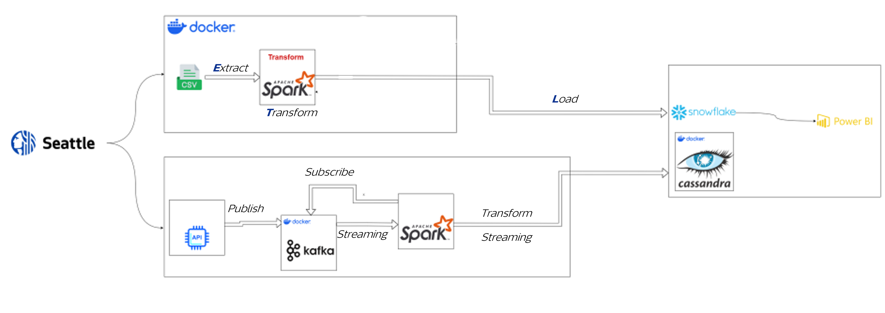
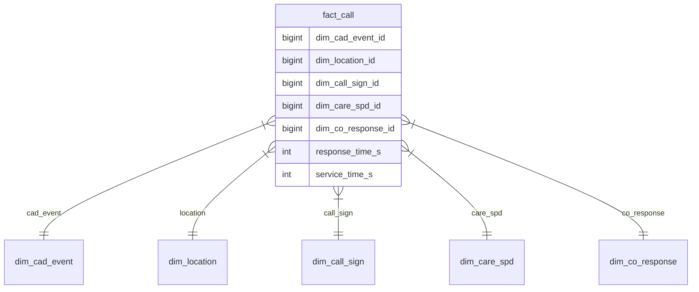
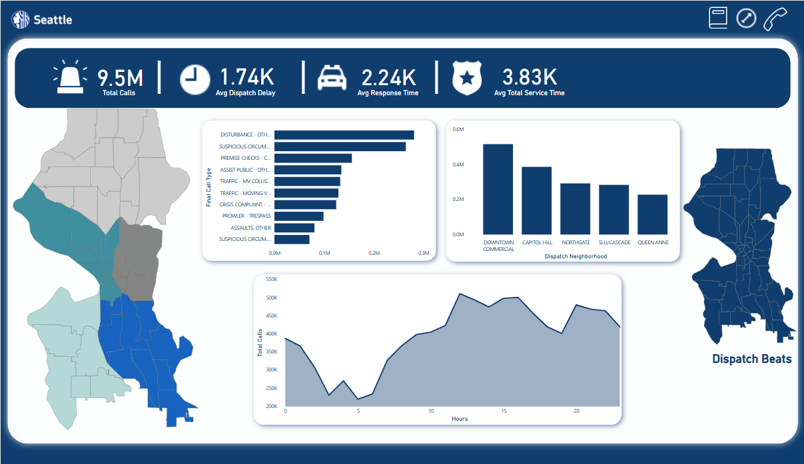
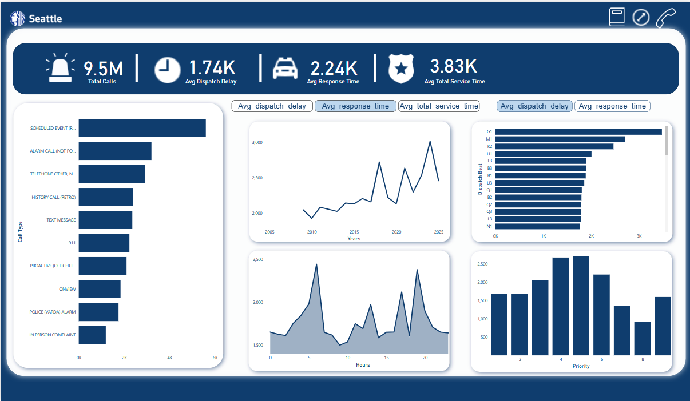

# 📞 Seattle 911 Call Data Pipeline (Batch + Stream)

## 🌟 Features

| Batch                             | Stream                         |
| --------------------------------- | ------------------------------ |
| ✅ CSV to Parquet/Snowflake       | ✅ Real-time API ingestion     |
| ✅ Star schema generation         | ✅ Kafka stream processing     |
| ✅ Historical data transformation | ✅ Cassandra storage           |
| ✅ Data quality checks            | ✅ Micro-batch transformations |

---

## 🏗️ System Architecture



---

## 📂 Directory Structure

```bash
ETL_Pipeline/
├── Batch/                    # [Batch] Historical processing
│   ├── extract.py            # CSV ingestion
│   ├── transform.py          # Star schema
│   └── load.py               # Snowflake/Parquet
│
├── Stream/                   # [Stream] Real-time
│   ├── producer.py           # Kafka producer
│   ├── consumer.py           # Spark→Cassandra
│   └── cassandra_setup/      # DB config
│
├── Data/                     # Inputs
└── Parquet_files/            # Batch outputs
```

---

## 🧊 Batch Processing

### 🔧 Technical Stack

- PySpark 3.5+
- Snowflake
- Parquet

### 🚀 Quick Start

```bash
python ETL_Pipeline_Batch/main.py
```

### ⚙️ Pipeline Stages

| Stage     | Description                 |
| --------- | --------------------------- |
| Extract   | Reads CSV from `Data/`      |
| Transform | Creates star schema         |
| Load      | Writes to Parquet/Snowflake |

---

## 🌟 Star Schema Diagram



---

## ⚡ Stream Processing

### 🔧 Technical Stack

- PySpark Streaming 3.5+
- Kafka
- Cassandra

### 🚀 Quick Start

```bash
# Start infrastructure
docker-compose up -d

# Run pipeline
python Stream/producer.py &
python Stream/consumer.py
```

### ⚙️ Components

| Component | Description                 |
| --------- | --------------------------- |
| Producer  | Fetches API → Kafka topic   |
| Consumer  | Spark Streaming → Cassandra |
| Cassandra | Stores in `police_calls`    |

---

### 📊 Cassandra Schema

```sql
CREATE TABLE police_calls (
    cad_event_number text PRIMARY KEY,
    call_type text,
    processed_at timestamp
    -- ...45+ fields
);
```

---

### 🔍 Sample Query

```sql
SELECT call_type, COUNT(*)
FROM seattle_data.police_calls
GROUP BY call_type;
```

## 📊 Power BI Dashboards

### Overview Dashboard



### Key Metrics Dashboard



---

## 📝 License

Apache 2.0 — See [`LICENSE`](./LICENSE) for details
